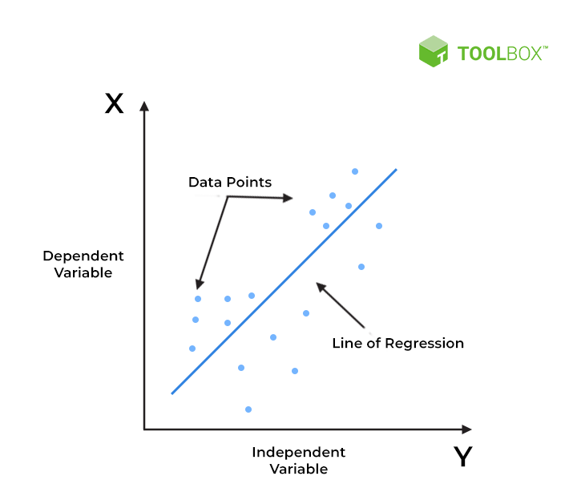

# LinearRegressionModel_Prediction

# This is a prediciton model using Linear Regression 
Linear regression is a type of supervised machine-learning algorithm that learns from the labelled datasets and maps 
the data points with most optimized linear functions which can be used for prediction on new datasets. 
It assumes that there is a linear relationship between the input and output, 
meaning the output changes at a constant rate as the input changes. This relationship is represented by 
a straight line.

In the above figure,
X-axis = Independent variable
Y-axis = Output / dependent variable
Line of regression = Best fit line for a model

# Key Concepts: 
    Dependent Variable: The variable you are trying to predict or explain. 
    Independent Variable: The variable(s) used to predict the dependent variable. 
    Regression Line: A straight line that best fits the data points, representing the linear relationship between the variables. 
    Slope: The change in the dependent variable for every unit change in the independent variable. 
    Y-intercept: The value of the dependent variable when the independent variable is zero. 
    
# Types of Linear Regression: 
1. Simple Linear Regression: Predicts one dependent variable based on one independent variable.
2. Multiple Linear Regression: Predicts one dependent variable based on two or more independent variables. 

# Model Basics
**Slope Equation Breakdown**

    Mathematically these slant lines follow the following equation,
    Y = m*X + b
    Where X = dependent variable (target)
    Y = independent variable
    m = slope of the line (slope is defined as the ‘rise’ over the ‘run’)
    
We will read the line equation for datascience as 

    y(x) = p1 * x + p0
    

    y = output variable. Variable y represents the continuous value that the model tries to predict.
    
    x = input variable. In machine learning, x is the feature, while it is termed the independent variable in statistics. 
        Variable x represents the input information provided to the model at any given time.
    
    p0 = y-axis intercept (or the bias term).
    
    p1 = the regression coefficient or scale factor. In classical statistics, 
        p1 is the equivalent of the slope of the best-fit straight line of the linear regression model.
    
    pi = weights (in general).    
    

## Explaination
    
For Solving Linear Regression we calculate slope and y-intercept 
    
    considering x and y are input lists and n is the length of list      
    
    
    For Calculating Slope (m)

        
    m(Slope) = (n * sum(xy) - sum(x) * sum(y)) / (n * sum(x^2) - (sum(x))^2)

    y-intercepts = (sum(y) - m * sum(x)) / n
    

## Prediction function for Target value 
    return self.slope * targetValue + self.intercept
    
    

# Purpose: 
1. Linear regression helps understand how a change in one variable (independent variable) affects another variable (dependent variable).
2. It's used for prediction, where the goal is to estimate the value of a dependent variable based on the value of one or more independent variables.

## Breakdown of Project 
1. Best Fit Line 
The goal of linear regression is to find a straight line that minimizes the error (the difference) between the 
observed data points and the predicted values. This line helps us predict the dependent variable for new, unseen data.

## Dataset Info

The dataset consists of used card dataset from kaggle 
The link to dataset: https://github.com/furkhansuhail/ProjectData/raw/refs/heads/main/LinearRegressionDataset/used_cars_data.csv

The code to download and store the data is provided in the LinearRegression_UsedCarProcesProjection.py 
It checks if the file exist if not it downloads the csv file 

    Code to download Dataset 
    
    # Update the config class to include all needed fields
        @dataclass(frozen=True)
        class DataIngestionConfig:
            root_dir: Path
            source_URL: str
            local_data_file: Path
            STATUS_FILE: str
            ALL_REQUIRED_FILES: list  # Can be removed if not used
        
        
    # Properly create the config object
    config = DataIngestionConfig(
        root_dir=Path("Dataset"),  # <-- Folder where file is saved
        source_URL="https://github.com/furkhansuhail/ProjectData/raw/refs/heads/main/LinearRegressionDataset/used_cars_data.csv",
        local_data_file=Path("Dataset/used_cars_data.csv"),  # <-- CSV file name
        STATUS_FILE="Dataset/status.txt",
        ALL_REQUIRED_FILES=[]  # Can be removed or filled if necessary
    )
    
    
    def download_csv_file(source_URL, local_data_file):
        if local_data_file.exists():
            print(f"File already exists at: {local_data_file}")
        else:
            print(f"⬇Downloading file from {source_URL}...")
            file_path, _ = request.urlretrieve(
                url=source_URL,
                filename=local_data_file
            )
            print(f"File downloaded and saved to: {file_path}")

